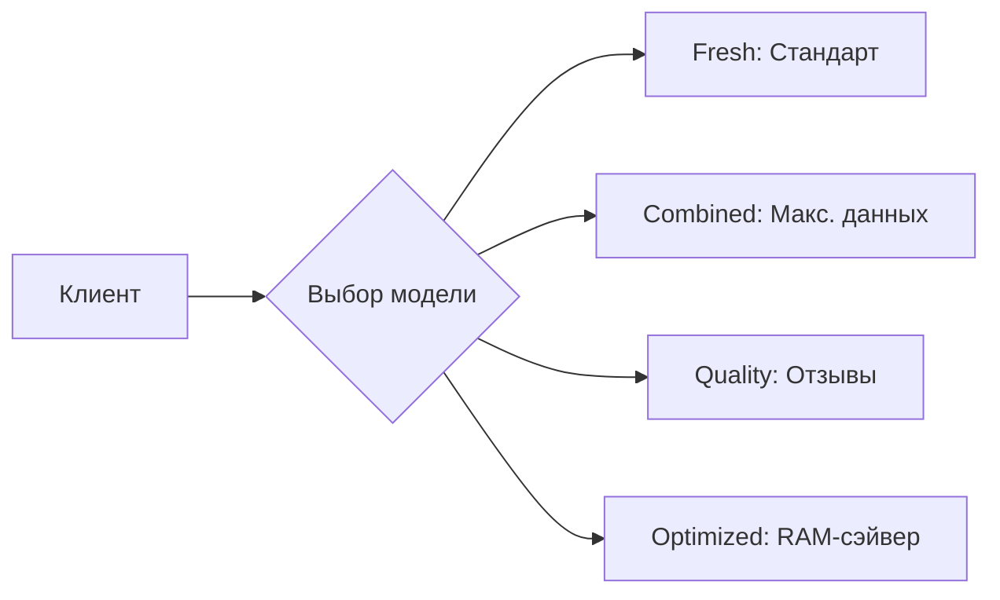

<p align="center">🧠 RuSentiment Hybrid Analytics</p>

<p align="center">
<a href="#">

</a>
<a href="#">

</a>
<a href="#">

</a>
</p>

<p align="center">
<b>Высокопроизводительный сервис анализа тональности для русского языка</b>


<i>Интеллектуальный баланс между скоростью классического ML и глубиной нейросетей.</i>
</p>

---

## ⚡ Визуализация архитектуры

Система использует **Smart Routing**, чтобы экономить ваши ресурсы без потери качества.

1. **Вход:** Текст поступает в систему.
2. **Маршрутизатор:** Оценивает длину и сложность (наличие сарказма, отрицаний).
3. **Выбор пути:**
* **Fast Path:** Обработка за **<5 мс** через оптимизированный LogReg.
* **Accurate Path:** Глубокий анализ через **BERT-контур** для сложных случаев.


---

## 🔥 Ключевые возможности

|  | Функция | Описание |
| --- | --- | --- |
| 🚀 | **Ultra-Fast** | Обработка до 500 RPS на обычном CPU. |
| 🤖 | **Multi-Model** | Переключение между 4-мя специализированными профилями. |
| 📊 | **Confidence Score** | Не просто результат, а точная степень уверенности модели. |
| 🧪 | **Live Dashboard** | Встроенный UI для мгновенного тестирования гипотез. |

---

## 📂 Доступные профили моделей



---

## 🚀 Быстрый старт

### 🛠 Установка окружения

```bash
# Клонируем и заходим
git clone https://github.com/your-username/rusentiment-hybrid.git && cd rusentiment-hybrid

# Ставим всё необходимое
pip install -r requirements.txt

```

### 🛰 Запуск ядра

```bash
python app/run_rusentiment.py

```

> **Info:** Документация Swagger автоматически доступна по адресу: `http://localhost:8000/docs`

---

## 📈 Пример аналитики

API возвращает детальный JSON с картой вероятностей:

```json
{
  "sentiment": "positive",
  "confidence": 0.942,
  "probabilities": {
    "positive": 0.94,
    "negative": 0.02,
    "neutral": 0.04
  },
  "routing": "fast_path_optimized"
}

```

---

## 🤝 Контакты

Если вам нравится проект, поставьте ему ⭐. Это помогает развитию!

---
